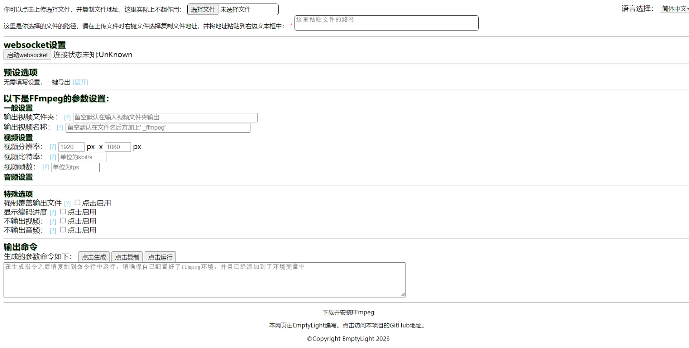
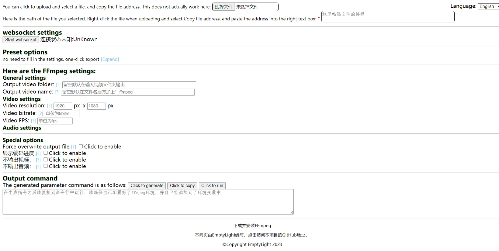

# ffmpegGUI

---

> **NOTICE**: this project is **only Chinese, English and Japanese** now, support for other languages is in progress, if you want to help us translate the document to your language, please [view here](localization.md).
> 
> **NOTICE**: If you don't have the `websockets` library for `python`, we provide a ***packaged portable version*** of the program (in *exe* format) in the release, which can be downloaded and run directly without downloading the `websockets` library.

---

## language choose
[简体中文](README_zh.md) [English](README.md)  

---

# screenshoot

# infos
In this project, I will use HTML to write a GUI for [ffmpeg](https:\\ffmpeg.org). It can finish the command by what you choose.  

## functionality now implemented and update targets
- [ ] Build a page to show the operator interface. This is the main component of our project.
- [ ] Use js to generate terminal commands according to user options.
- [x] Use websocket to pass commands to a local server terminal for execution. Provide a python file to start the backend server.
- [x] Web pages are localised/internationalised and constantly improved.
- [x] Modify the output folder and output file name of the output video. (Includes modifying the file format)
- [x] Adjusts the bit rate and frame rate of the output video.
- [x] Provides one-click generation of commands in preset formats.
- [x] Select not to output video/audio.
- [x] Add specify output video quality, it will influence video encode speed.
- [x] Add video/audio codec settings(sometimes it is useless).
- [ ] More features are still in progress ...

## update time
[view all](update_log.md)
| important update log  | update time |
| :-------------------- | :---------: |
| improve translation | 2023.08.11 |
| Added specify output video quality, specify video/audio codec, view supported codecs  | 2023.08.11  |
| add trad_Chinese and japanese translation  | 2023.08.07  |
| add show encoding progress, select whether to output video/audio | 2023.08.07  |
| complete language select function | 2023.08.05  |
| use `websocket` to send the command to the local server and run successfully. | 2023.08.03  |
| add preset options, generate command in single-click. add video resolution settings | 2023.08.02  |
| Improve usability by making it possible for file addresses to contain spaces, and fix bugs by making the copy button usable | 2023.08.01  |
| git init and have basic functions(output dir and filename, video byterate and fps)  | 2023.07.22  |